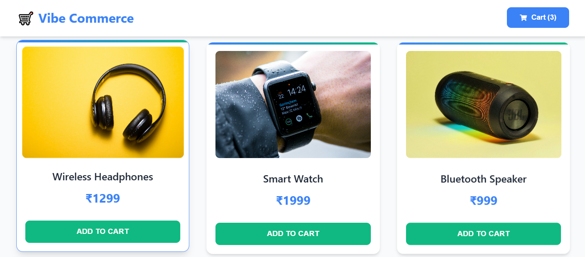
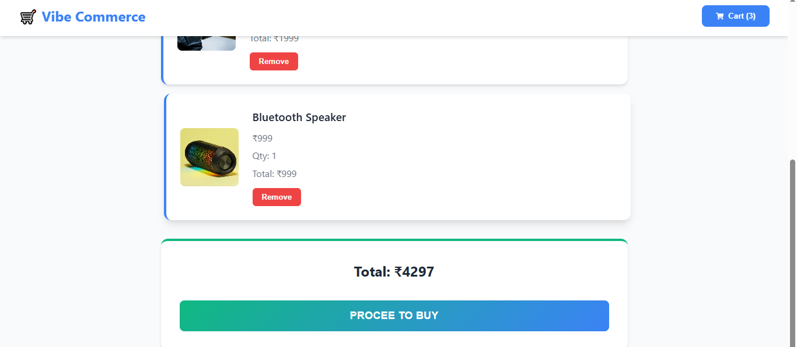
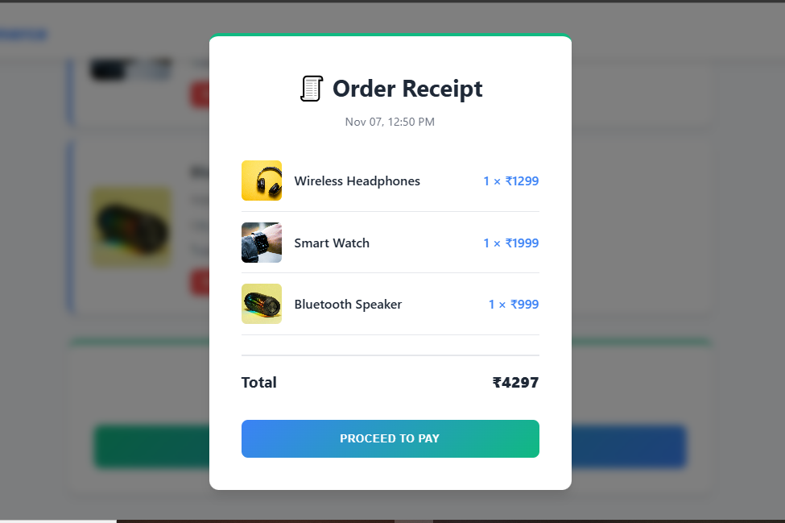

# Nexora Full Stack Shopping Cart App

This is a basic full-stack shopping cart application built as part of the Nexora Full Stack Development Assignment. It allows users to view products, add or remove items from the cart, view totals, and perform a mock checkout (no real payments) and i have used global css.

## Tech Stack

- **Frontend**: React,CSS
- **Backend**: Node.js, Express.js, MongoDB

## Features

- View all products
- Add and remove items from the cart
- Automatically calculate total price
- Mock checkout page
- Fully connected frontend and backend using REST APIs


## Screenshots

### Products Page


### Cart Page


### Checkout / Receipt



## Folder Structure
project-folder/
├── frontend/ → vibe-commerce → React app (UI)
├── backend/ → Node.js + Express server
└── README.md

text

## How to Run the Project

## Backend Setup

```bash
cd backend
npm install
Create a .env file inside the backend folder and add:
MONGO_URI=your_mongodb_connection_string
PORT=5000
Start the backend server:
npm start
```

## Frontend Setup
```bash
cd frontend
npm install
npm run dev
```

## API Endpoints

| Method | Endpoint | Description |
|--------|-----------|-------------|
| GET | `/api/products` | Fetch (id, name, price) |
| POST | `/api/cart` | Add item to cart `{ productId, qty }` |
| DELETE | `/api/cart/:id` | Remove item from cart |
| GET | `/api/cart` | Get all cart items with total amount |
| POST | `/api/checkout` | Generate mock receipt (total, timestamp) |

## Author

**Rahul Belavadi**  
Email: rahulbelavadi05@gmail.com
Mob: +91 9901420573